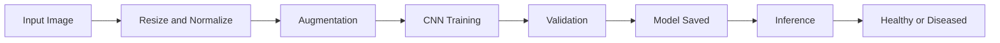
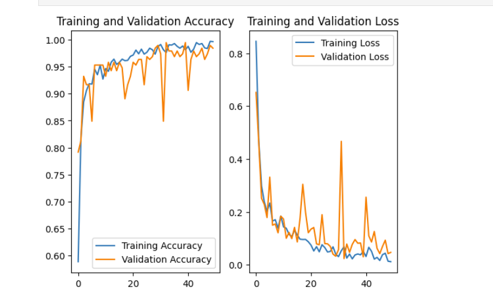

# 🥔 Potato Leaf Disease Classification using Deep Learning

## 📖 Introduction

Potato crops are highly vulnerable to fungal and bacterial diseases such as Early Blight and Late Blight, which can significantly reduce agricultural productivity and farmer income.

This project aims to build a Deep Learning-based image classification system that automatically detects potato leaf diseases from leaf images. The model classifies images into:

- 🟢 Healthy
- 🟡 Early Blight
- 🔴 Late Blight

By leveraging Convolutional Neural Networks (CNNs), this system enables early detection, helping farmers take preventive measures and minimize crop damage.

---

## 🎯 Problem Statement

Manual disease detection requires expert knowledge and is time-consuming. There is a need for an automated, scalable, and accurate system that can detect plant diseases using image data.

---

## 🚀 Solution Overview

This project implements:

- Image preprocessing and augmentation pipeline
- CNN-based deep learning architecture
- Optimized TensorFlow dataset pipeline using `cache()` and `prefetch()`
- High-accuracy classification model (95%+ validation accuracy)
- Model saving and inference pipeline for real-time prediction

---

## 🏗️ System Architecture

## 📊 Training Results & Performance Analysis

### 📈 Accuracy Curve

The model shows strong learning behavior across epochs.

- Training accuracy steadily increased and reached ~99%.
- Validation accuracy stabilized above 95%.
- Minor fluctuations in validation accuracy indicate natural dataset variance.
- No major divergence between training and validation curves → minimal overfitting.

### 📉 Loss Curve

- Training loss consistently decreased towards near zero.
- Validation loss followed a similar downward trend.
- Occasional spikes in validation loss are due to batch-level variance.
- Overall convergence confirms stable learning and good generalization.

---

## ⚡ Dataset Optimization

To improve training efficiency and pipeline performance, TensorFlow dataset optimization techniques were used:

- `cache()` → Caches dataset in memory after first epoch, reducing disk I/O.
- `prefetch(buffer_size=tf.data.AUTOTUNE)` → Enables parallel data loading and model training.
- Applied to:
  - Training dataset
  - Validation dataset
  - Test dataset

This significantly improved GPU utilization and reduced training latency.

---

## 📷 Training Visualizations

### Accuracy & Loss Graphs

